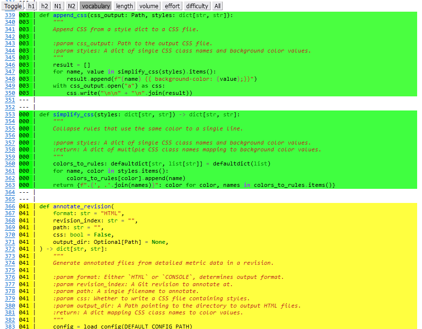

Annotate Command
================

The annotate command will generate annotated Python source and output it to console or save as HTML, with metric values for a revision or single file. It currently supports Cyclomatic Complexity and Halstead metrics.

Examples
--------

To annotate all files known at revision ``HEAD`` and display them in the console, simply call ``wily annotate``. 

.. code-block:: none

  $ wily annotate

To output to HTML files instead of printing to console, pass the ``-f HTML`` option.

.. code-block:: none

  $ wily annotate -f HTML

When outputting HTML files, annotate will create a CSS file with styles for highlighting code and annotations.
To suppress creation of the CSS file, for example to use an existing or customized file, pass the "--no-css" option.

.. code-block:: none

  $ wily annotate -f HTML --no-css

To annotate a specific file, pass the ``-p`` option. 

.. code-block:: none

  $ wily annotate -p example.py

To annotate files known at a given revision, add the ``-r`` option. 

.. code-block:: none

  $ wily annotate -r HEAD~2

By default, ``wily annotate`` will create files in the ``reports`` subdirectory.
To save the output to another directory, provide the ``-o`` flag and the name of the output directory.

.. code-block:: none

   $ wily annotate -o annotated_source/

Command Line Usage
------------------

.. click:: wily.__main__:annotate
   :prog: wily
   :show-nested:
