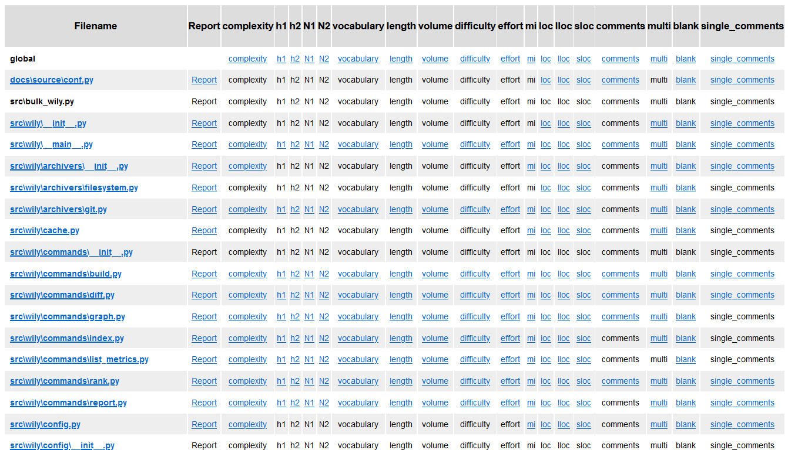

Bulk command
============

The bulk command will create an index HTML page, multiple HTML reports and graphs for a Python project stored in Git. It also allows cleaning the bulk generated files.

By default, reports and graphs will be created for all tracked files that ever existed in the Git repository and saved to "reports/". 

Examples
--------

Create a bulk report of all files from known revisions in wily's cache.

.. code-block:: none

  $ wily bulk build

By default, wily will use all known metrics to build a bulk report.

To change the metrics, provide the metric names (run ``wily list-metrics`` for a list) as comma-separated arguments.

.. code-block:: none

  $ wily bulk build --metrics loc,mi,complexity

To build a bulk report for selected files, pass paths as arguments.

.. code-block:: none

  $ wily bulk build file1.py file2.py dir/file3.py

Clean all files generated for a bulk report.
.. code-block:: none

  $ wily bulk clean

Command Line Usage
------------------

.. click:: wily.__main__:bulk
   :prog: wily
   :show-nested:
